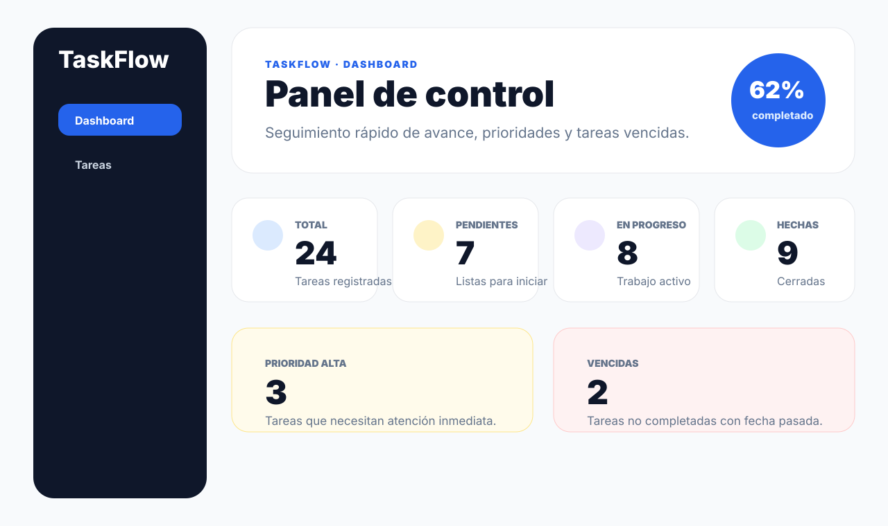
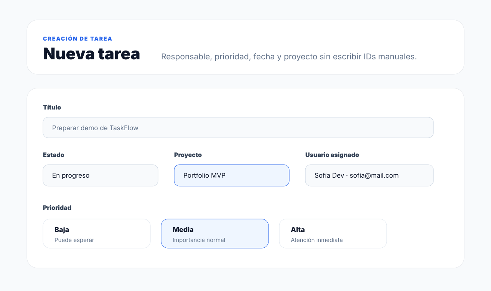

# TaskFlow MVP

TaskFlow es una aplicación full-stack para gestionar proyectos y tareas. El foco del proyecto es demostrar un flujo completo de backend Spring Boot + PostgreSQL + JWT y frontend Angular con dashboard, filtros, formularios y documentación lista para portfolio.

## Screenshots

| Dashboard | Formulario de tarea |
| --- | --- |
|  |  |

## Funcionalidades

- Autenticación con `POST /auth/login` y tokens JWT.
- Registro público de usuarios con `POST /api/users/register`.
- Endpoints protegidos con `Authorization: Bearer <token>`.
- CRUD de usuarios, tareas y proyectos.
- Tareas con estado (`PENDING`, `IN_PROGRESS`, `DONE`), prioridad (`LOW`, `MEDIUM`, `HIGH`) y fecha límite.
- Relación entre usuarios, proyectos y tareas.
- Filtros de tareas por estado, usuario asignado, prioridad y rango de fechas.
- Dashboard con cards de resumen, porcentaje completado, tareas de prioridad alta y tareas vencidas.
- Formulario Angular para crear/editar tareas con selector de proyecto y usuario asignado.

## Stack técnico

### Backend

- Java 17
- Spring Boot
- Spring Web MVC
- Spring Data JPA
- Spring Security
- JWT con `jjwt`
- PostgreSQL
- Docker Compose para base de datos local

### Frontend

- Angular 20
- Angular Router
- Angular Reactive Forms
- Angular HTTP Client e interceptor JWT
- SCSS

## Estructura principal

```text
taskflow-mvp/
├── backend/taskflow-api/taskflow-api/   # API Spring Boot
├── frontend/                            # App Angular
├── docs/screenshots/                    # Capturas versionadas para portfolio
└── docker-compose.yml                   # PostgreSQL local
```

## Cómo ejecutar en local

### 1. Levantar PostgreSQL

```bash
cd taskflow-mvp
docker compose up -d
```

La base queda disponible en `localhost:5434` con:

- DB: `taskflow`
- Usuario: `taskflow_user`
- Password: `taskflow_pass`

### 2. Levantar backend

```bash
cd taskflow-mvp/backend/taskflow-api/taskflow-api
bash ./mvnw spring-boot:run
```

La API corre en `http://localhost:8081`.

### 3. Levantar frontend

```bash
cd taskflow-mvp/frontend
npm install
npm run start
```

Angular corre en `http://localhost:4200`.

## Endpoints principales

### Auth

| Método | Endpoint | Descripción |
| --- | --- | --- |
| `POST` | `/auth/login` | Devuelve JWT para credenciales válidas. |

### Usuarios

| Método | Endpoint | Descripción |
| --- | --- | --- |
| `GET` | `/api/users` | Lista usuarios. |
| `POST` | `/api/users` | Crea usuario. |
| `POST` | `/api/users/register` | Registro público. |
| `DELETE` | `/api/users/{id}` | Elimina usuario. |

### Proyectos

| Método | Endpoint | Descripción |
| --- | --- | --- |
| `GET` | `/api/projects` | Lista proyectos. |
| `GET` | `/api/projects/{id}` | Obtiene un proyecto. |
| `POST` | `/api/projects` | Crea proyecto. |
| `PUT` | `/api/projects/{id}` | Actualiza proyecto. |
| `DELETE` | `/api/projects/{id}` | Elimina proyecto. |

### Tareas

| Método | Endpoint | Descripción |
| --- | --- | --- |
| `GET` | `/api/tasks` | Lista tareas con filtros opcionales. |
| `GET` | `/api/tasks/{id}` | Obtiene una tarea. |
| `POST` | `/api/tasks` | Crea tarea. |
| `PUT` | `/api/tasks/{id}` | Actualiza tarea. |
| `DELETE` | `/api/tasks/{id}` | Elimina tarea. |
| `GET` | `/api/tasks/by-user/{userId}` | Lista tareas asignadas a usuario. |
| `GET` | `/api/tasks/by-project/{projectId}` | Lista tareas de un proyecto. |

Filtros soportados en `GET /api/tasks`:

- `status`
- `assignedToUserId`
- `priority`
- `dueFrom`
- `dueTo`

## Flujo rápido para probar

1. Registrar usuario con `POST /api/users/register`.
2. Iniciar sesión con `POST /auth/login`.
3. Copiar el token y usarlo como `Authorization: Bearer <token>`.
4. Crear un proyecto con `POST /api/projects`.
5. Crear tareas desde la UI Angular o con `POST /api/tasks`.
6. Ver métricas en dashboard y filtrar tareas desde el listado.

## Estado del roadmap

- ✅ Etapa 1: backend base, PostgreSQL y entidades principales.
- ✅ Etapa 2: CRUD real de usuarios, tareas y proyectos.
- ✅ Etapa 3: autenticación con JWT y endpoints protegidos.
- ✅ Etapa 4: frontend Angular con login, dashboard y gestión de tareas.
- ✅ Etapa 5: filtros, prioridades, fechas y UI mejorada.
- ✅ Etapa 6: README, screenshots y explicación técnica para portfolio.

## Decisiones de arquitectura

- **API por capas:** los controladores se limitan al contrato HTTP; los servicios concentran reglas de negocio y transacciones; los repositorios aíslan persistencia.
- **DTOs en los límites:** la API no expone contraseñas ni serializa directamente el grafo de entidades JPA.
- **Seguridad stateless:** cada request protegido valida un JWT, sin sesión de servidor. La clave, expiración, conexión y origen CORS se configuran con variables de entorno.
- **Filtros componibles:** el listado usa JPA Specifications para combinar filtros opcionales sin multiplicar consultas específicas.
- **Frontend por features:** rutas lazy, modelos tipados, servicios HTTP, interceptor y guard separan infraestructura de las pantallas.
- **Errores predecibles:** las validaciones se devuelven con un contrato JSON común (`timestamp`, `status`, `message`, `path` y `fieldErrors`).

## Variables de entorno del backend

| Variable | Uso | Valor local por defecto |
| --- | --- | --- |
| `DB_URL` | JDBC URL de PostgreSQL | `jdbc:postgresql://localhost:5434/taskflow` |
| `DB_USERNAME` | Usuario de base | `taskflow_user` |
| `DB_PASSWORD` | Contraseña de base | `taskflow_pass` |
| `JWT_SECRET` | Firma HMAC del token | Solo desarrollo; reemplazar en producción |
| `JWT_EXPIRATION` | Vida del token en ms | `86400000` |
| `CORS_ALLOWED_ORIGIN` | Origen permitido | `http://localhost:4200` |

> Para un despliegue real, `JWT_SECRET` y las credenciales deben provenir de un secret manager y nunca del repositorio.

## Guion breve para la entrevista

1. **Problema:** equipos pequeños necesitan visualizar carga, responsables y vencimientos sin una herramienta pesada.
2. **Recorrido:** login → métricas → filtros → alta/edición de una tarea → confirmación de borrado.
3. **Profundidad técnica:** explicar JWT stateless, DTOs, transacciones, Specifications, lazy routes e interceptor.
4. **Trade-offs:** este MVP usa `ddl-auto=update`; el siguiente paso productivo sería Flyway, refresh tokens, paginación y autorización por ownership/rol.
5. **Calidad:** mostrar las suites automatizadas y el build de producción antes de la demo.

## Checklist antes de presentar

- Levantar PostgreSQL, API y frontend desde una instalación limpia.
- Crear datos de demo coherentes (un proyecto, tres usuarios y tareas en distintos estados).
- Cambiar `JWT_SECRET` y verificar login/logout, filtros, formularios y responsive.
- Ejecutar `mvn test`, `npm test -- --watch=false --browsers=ChromeHeadless` y `npm run build`.
- Preparar una explicación de 3 minutos y una respuesta para cada trade-off documentado.
